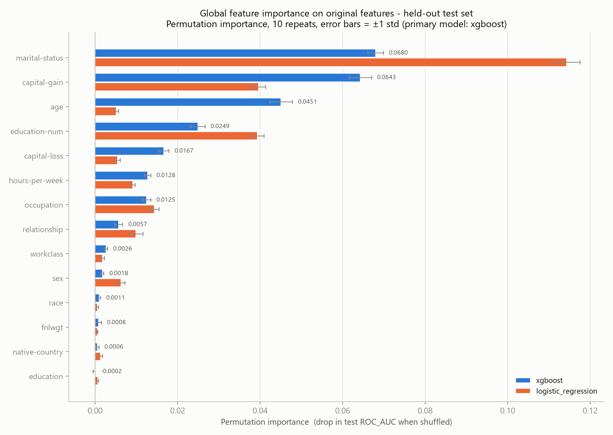

# Phase 3 — Explainability Audit: Adult Income Baseline

Explainability audit of the saved **xgboost** pipeline (best Phase-1 held-out performance), with **logistic_regression** as a comparison. Scored on the same deterministic held-out test set as Phases 1–2 (`test_size=0.2`, `stratify=y`, `random_state=42`).

**Read-only:** models, predictions, Phase-1 metrics and Phase-2 fairness outputs were loaded but never modified. All artefacts here are written under `results/explainability/`.

## 1. Method

- **Permutation importance** on the held-out test set, 10 repeats, `random_state=42`. Importance = the drop in score when a single column is randomly shuffled.
- Crucially, permutation is applied to the **raw input columns through the whole pipeline**, so a shuffled `occupation` is re-encoded by the fitted preprocessor and the importance is attributed to `occupation` itself — not spread across its 41 one-hot fragments. All importances below are therefore **original, human-readable features**.
- Primary scorer **ROC_AUC** (threshold-free), reported alongside accuracy and F1. Baseline test scores: roc_auc = 0.9299, accuracy = 0.8782, f1 = 0.7239.
- **Local attributions** use XGBoost's built-in exact **TreeSHAP** (`pred_contribs=True`) — no approximation and no extra dependency. Values are in log-odds and additive, so the one-hot contributions of a feature sum exactly back to it. Additivity was asserted numerically: `base + Σ contributions` reproduces each pipeline probability to < 1e-4.
- The dataset has **14 original features**, so "top 15" is the complete ranked set rather than a truncation.

## 2. Global feature importance

Ranked by xgboost permutation importance on test ROC_AUC. `± std` is the standard deviation across permutation repeats; where it is comparable to the mean, the feature is **not distinguishable from unimportant**.

| # | feature | xgboost Δroc_auc | ± std | xgboost Δacc | logistic_regression Δroc_auc | XGB native gain share | LR coef spread |
|---:|---|---:|---:|---:|---:|---:|---:|
| 1 | `marital-status` 🟡 | 0.0680 | 0.0019 | 0.0422 | 0.1143 | 0.387 | 2.54 |
| 2 | `capital-gain` | 0.0643 | 0.0027 | 0.0531 | 0.0396 | 0.055 | 2.29 |
| 3 | `age` | 0.0451 | 0.0028 | 0.0210 | 0.0051 | 0.010 | 0.31 |
| 4 | `education-num` 🟡 | 0.0249 | 0.0017 | 0.0282 | 0.0393 | 0.040 | 0.78 |
| 5 | `capital-loss` | 0.0167 | 0.0013 | 0.0143 | 0.0055 | 0.023 | 0.26 |
| 6 | `hours-per-week` 🟡 | 0.0128 | 0.0007 | 0.0099 | 0.0091 | 0.008 | 0.39 |
| 7 | `occupation` 🟡 | 0.0125 | 0.0011 | 0.0178 | 0.0143 | 0.127 | 2.38 |
| 8 | `relationship` 🟡 | 0.0057 | 0.0010 | 0.0041 | 0.0099 | 0.075 | 1.93 |
| 9 | `workclass` | 0.0026 | 0.0004 | 0.0063 | 0.0018 | 0.044 | 1.08 |
| 10 | `sex` 🔴 | 0.0018 | 0.0003 | 0.0018 | 0.0063 | 0.015 | 0.73 |
| 11 | `race` 🔴 | 0.0011 | 0.0003 | 0.0015 | 0.0006 | 0.023 | 0.66 |
| 12 | `fnlwgt` | 0.0008 | 0.0007 | 0.0033 | 0.0006 | 0.004 | 0.07 |
| 13 | `native-country` 🟡 | 0.0006 | 0.0003 | 0.0005 | 0.0013 | 0.116 | 2.50 |
| 14 | `education` 🟡 | -0.0002 | 0.0002 | 0.0012 | 0.0006 | 0.074 | 0.99 |

🔴 = protected attribute · 🟡 = likely proxy for a protected attribute

### 2.1 What feature importance does and does not prove

**It does establish:**

- **Reliance.** A large drop when `marital-status` is shuffled means *this fitted model's* test performance depends on that column. That is a fact about the model, and it is actionable: it tells you what breaks if the feature degrades in production.
- **Redundancy, when importance is low.** A near-zero score means the model can be denied that column without losing measurable performance.

**It does not establish:**

- **Causation.** Nothing here says being married *causes* higher income. Importance is a measure of statistical association exploited by one fitted model on one dataset. Marriage, earnings, age and sex are entangled in the 1994 labour market; permutation importance cannot separate them and is not a causal method.
- **That a low-importance feature is unused or harmless.** Permutation importance is notoriously **diluted by correlated features**: when two columns carry the same signal, shuffling either one alone barely moves the score, because the model recovers the information from its partner. Both then look unimportant while the *information* remains fully in use. `education` and `education-num` are a literal duplicate pair here, and `relationship` and `marital-status` overlap heavily — so their individual scores are **lower bounds**, not measures of the underlying signal's importance.
- **That importance is a fairness measure.** Ranking says nothing about *how* a feature is used, for whom, or in which direction. A feature can rank low globally and still drive the decision for a specific subgroup.
- **Stability.** Rankings shift with the scorer, the split and the model — compare the two model columns above. There is no single true importance order.
- **Permuting breaks the joint distribution.** Shuffling one column creates records that could not exist (e.g. `relationship = Wife` with `sex = Male`), so the model is scored partly off-manifold. This inflates apparent importance for features locked into strong dependencies with others.

## 3. xgboost vs logistic_regression

Permutation importance is directly comparable between the two models (same unit, same test set) and appears side by side in §2. Logistic Regression adds something the tree model cannot give directly: a **signed, additive** coefficient per encoded column.

Strongest 10 LR coefficients (log-odds):

| transformed column | original feature | coefficient | direction |
|---|---|---:|---|
| `capital-gain` | `capital-gain` | +2.290 | increases P(>50K) |
| `occupation_Priv-house-serv` | `occupation` | -1.586 | decreases P(>50K) |
| `native-country_South` | `native-country` | -1.436 | decreases P(>50K) |
| `marital-status_Married-civ-spouse` | `marital-status` | +1.424 | increases P(>50K) |
| `marital-status_Married-AF-spouse` | `marital-status` | +1.208 | increases P(>50K) |
| `native-country_Columbia` | `native-country` | -1.182 | decreases P(>50K) |
| `marital-status_Never-married` | `marital-status` | -1.118 | decreases P(>50K) |
| `native-country_France` | `native-country` | +1.060 | increases P(>50K) |
| `relationship_Own-child` | `relationship` | -1.004 | decreases P(>50K) |
| `sex_Female` | `sex` | -0.924 | decreases P(>50K) |

**Two interpretation caveats.** Numeric coefficients are per **1 standard deviation** (the numeric branch is standardised), not per natural unit — a coefficient on `age` is not "per year". And because no baseline one-hot category was dropped, a single dummy coefficient is meaningful only *relative to the other categories of the same feature*, never as an absolute effect; that is why the per-feature summary uses the **spread** (max − min) across a feature's categories. Coefficients are also not importances: a large coefficient on a rare category moves few predictions.

The two models broadly agree on what matters: xgboost's top 5 is `marital-status`, `capital-gain`, `age`, `education-num`, `capital-loss`, against `marital-status`, `capital-gain`, `education-num`, `occupation`, `relationship` for logistic_regression. Agreement between a linear model and a boosted ensemble is reassuring about the *signal*, but it is not independent corroboration — both learned from the same features and the same historical labels.

## 4. Local explanations (5 held-out cases)

One representative record per error quadrant, plus one borderline case. Within each quadrant the record whose predicted probability is **closest to that quadrant's median** was chosen — a typical case, not the most confident one, which would flatter the model. Selection is deterministic.

**Privacy.** Only a synthetic `case_id` is published; the underlying dataset row index is deliberately withheld so these rows cannot be joined back to a specific census record. Feature values are shown because an attribution is meaningless without the value it attaches to, and `sex`/`race` appear only because they are model inputs under audit. This is a public academic benchmark of 1994 records; the same disclosure in a live system would need a formal privacy review.

### true_positive

- actual = **1** (>50K) · predicted = **1** (>50K) · P(>50K) = **0.8717** · base log-odds = -1.2010

| rank | feature | value | SHAP (log-odds) | effect |
|---:|---|---|---:|---|
| 1 | `education-num` | 16.0 | +1.6621 | pushes toward >50K |
| 2 | `marital-status` | Married-civ-spouse | +0.7052 | pushes toward >50K |
| 3 | `hours-per-week` | 50.0 | +0.3708 | pushes toward >50K |
| 4 | `occupation` | Prof-specialty | +0.2101 | pushes toward >50K |
| 5 | `workclass` | Self-emp-inc | +0.2071 | pushes toward >50K |
| 6 | `capital-gain` | 0.0 | -0.1664 | pushes toward <=50K |

Remaining 8 features together: +0.1279 log-odds.

### true_negative

- actual = **0** (<=50K) · predicted = **0** (<=50K) · P(>50K) = **0.0169** · base log-odds = -1.2010

| rank | feature | value | SHAP (log-odds) | effect |
|---:|---|---|---:|---|
| 1 | `marital-status` | Divorced | -1.2452 | pushes toward <=50K |
| 2 | `relationship` | Own-child | -0.8762 | pushes toward <=50K |
| 3 | `education-num` | 9.0 | -0.4757 | pushes toward <=50K |
| 4 | `education` | HS-grad | -0.2424 | pushes toward <=50K |
| 5 | `age` | 41.0 | +0.2123 | pushes toward >50K |
| 6 | `capital-gain` | 0.0 | -0.1879 | pushes toward <=50K |

Remaining 8 features together: -0.0484 log-odds.

### false_positive

- actual = **0** (<=50K) · predicted = **1** (>50K) · P(>50K) = **0.6495** · base log-odds = -1.2010

| rank | feature | value | SHAP (log-odds) | effect |
|---:|---|---|---:|---|
| 1 | `marital-status` | Married-civ-spouse | +0.7765 | pushes toward >50K |
| 2 | `education-num` | 13.0 | +0.7509 | pushes toward >50K |
| 3 | `hours-per-week` | 55.0 | +0.5606 | pushes toward >50K |
| 4 | `race` | Black | -0.2643 | pushes toward <=50K |
| 5 | `capital-gain` | 0.0 | -0.1951 | pushes toward <=50K |
| 6 | `occupation` | Sales | +0.1904 | pushes toward >50K |

Remaining 8 features together: -0.0014 log-odds.

### false_negative

- actual = **1** (>50K) · predicted = **0** (<=50K) · P(>50K) = **0.2708** · base log-odds = -1.2010

| rank | feature | value | SHAP (log-odds) | effect |
|---:|---|---|---:|---|
| 1 | `marital-status` | Married-civ-spouse | +0.8660 | pushes toward >50K |
| 2 | `relationship` | Wife | +0.5800 | pushes toward >50K |
| 3 | `age` | 33.0 | -0.4489 | pushes toward <=50K |
| 4 | `fnlwgt` | 26973.0 | -0.3012 | pushes toward <=50K |
| 5 | `capital-gain` | 0.0 | -0.2106 | pushes toward <=50K |
| 6 | `sex` | Female | -0.1595 | pushes toward <=50K |

Remaining 8 features together: -0.1154 log-odds.

### borderline_near_0.5

- actual = **0** (<=50K) · predicted = **0** (<=50K) · P(>50K) = **0.4999** · base log-odds = -1.2010

| rank | feature | value | SHAP (log-odds) | effect |
|---:|---|---|---:|---|
| 1 | `marital-status` | Married-civ-spouse | +0.7439 | pushes toward >50K |
| 2 | `education-num` | 13.0 | +0.6420 | pushes toward >50K |
| 3 | `workclass` | Self-emp-not-inc | -0.5466 | pushes toward <=50K |
| 4 | `occupation` | Sales | +0.2220 | pushes toward >50K |
| 5 | `capital-gain` | 0.0 | -0.1922 | pushes toward <=50K |
| 6 | `age` | 42.0 | +0.1311 | pushes toward >50K |

Remaining 8 features together: +0.2003 log-odds.

All 14 features are recorded for every case in `local_explanations.csv`, ranked by absolute contribution.

## 5. Governance-relevant concerns

### 5.1 Are protected attributes and their proxies driving the model?

| feature | class | global rank | xgboost Δroc_auc | in any case's top 3? |
|---|---|---:|---:|---|
| `sex` | **protected** | 10 | 0.0018 | — |
| `race` | **protected** | 11 | 0.0011 | — |
| `marital-status` | likely proxy | 1 | 0.0680 | true_positive, true_negative, false_positive, false_negative, borderline_near_0.5 |
| `relationship` | likely proxy | 8 | 0.0057 | true_negative, false_negative |
| `occupation` | likely proxy | 7 | 0.0125 | — |
| `education` | likely proxy | 14 | -0.0002 | — |
| `education-num` | likely proxy | 4 | 0.0249 | true_positive, true_negative, false_positive, borderline_near_0.5 |
| `hours-per-week` | likely proxy | 6 | 0.0128 | true_positive, false_positive |
| `native-country` | likely proxy | 13 | 0.0006 | — |

**What the audit found.**

- `sex` ranks **10/14** (Δroc_auc = 0.0018) and `race` ranks **11/14** (Δroc_auc = 0.0011). Both are near the bottom: shuffling them barely changes test performance.
- **The single most important feature is a likely proxy** — `marital-status` at rank 1 — and 5 of the 7 watch-listed proxies rank above both protected attributes (`marital-status` #1, `education-num` #4, `hours-per-week` #6, `occupation` #7, `relationship` #8).
- Precision matters here: the ranking is **not** wholly proxy-driven. `capital-gain`, `age`, `capital-loss` are also top-5 and are financial/age variables rather than watch-listed proxies. The finding is that proxies outrank the protected attributes, not that proxies are the only thing the model uses.
- `relationship` (rank 8) deserves specific attention regardless of its rank: its categories `Husband` and `Wife` are **sex-coded by construction**, so this feature carries `sex` explicitly, under another name. That it outranks `sex` itself is the clearest single illustration of proxy encoding in this model.
- `education` ranks last (14/14) with a slightly **negative** score — shuffling it marginally *helped*. This is not evidence that education is irrelevant: it is a duplicate of `education-num` (rank 4), so the model recovers the signal from the twin column. It is the dilution effect of §2.1 caught in the act, and a worked example of why a low importance score must never be read as "unused".

### 5.2 Association is not causation

Every number in this report is **associational**. Permutation importance and SHAP both describe how a *fitted function* responds to its inputs on a *particular dataset*; neither is a causal estimand. "`marital-status` is the most important feature" means the model's accuracy depends on that column — not that marriage raises income, and not that changing someone's marital status would change their earnings. A SHAP value of `+1.2` for `marital-status = Married-civ-spouse` is a statement about the model's arithmetic, not about the world. Causal claims would require an explicit causal model and assumptions that this audit neither states nor tests.

### 5.3 Absence from the model does not prove absence of proxy discrimination

This is the central governance point, and the data above demonstrates it rather than merely asserting it.

`sex` ranks 10/14 and `race` ranks 11/14 — so a naive reading would be "the model barely uses them; it is fair." Phase 2 measured the opposite: **selection-rate ratios of ~0.30–0.32 for women and three of four non-reference race groups below the four-fifths threshold**. Low importance and large disparity coexist without contradiction, for three reasons:

1. **Redundant encoding.** `relationship` (`Husband`/`Wife`), `marital-status`, `occupation` and `hours-per-week` jointly reconstruct sex to a large degree. Once they are present, `sex` adds little *incremental* signal — so permutation importance, which measures exactly that increment, correctly reports a small number while the information is fully in use.
2. **Deleting a feature does not delete its signal.** Dropping `sex` and `race` would leave the proxies, and very likely leave the disparities, while removing the ability to measure them. "Fairness through unawareness" fails here for reasons visible in this table.
3. **Global rankings average over people.** A feature can be irrelevant on average and decisive for a subgroup. Only the disaggregated Phase-2 metrics and per-case attributions can see that.

**Therefore: low importance for `sex`/`race` is not evidence of fairness, and removing them would not be a mitigation.** Proxy discrimination has to be tested for on outcomes, per group — which is what Phase 2 does — not inferred from a feature list.

## 6. Limitations

- **Correlated-feature dilution.** As above, importances for `education` / `education-num` and `relationship` / `marital-status` are lower bounds. Grouped permutation (shuffling correlated features together) would give a truer picture and was not run.
- **Off-manifold scoring.** Permutation creates impossible records (`relationship = Wife`, `sex = Male`), so part of the measured drop reflects the model being asked about inputs that cannot occur.
- **Single split, single seed.** One 9,769-row test set, `random_state=42`. Importance ranks — especially adjacent ones with overlapping error bars — are not stable across resamples; no bootstrap was run.
- **Five local cases are illustrative, not representative.** They show *how* the model reasons in five instances and cannot support any claim about population-level behaviour or about subgroups.
- **SHAP is exact but not unique.** TreeSHAP gives the exact Shapley values for this model, yet Shapley attribution is one choice among several (LIME, counterfactuals, integrated gradients) that can rank factors differently. Exactness of computation is not uniqueness of explanation.
- **Log-odds are not probabilities.** A `+1.2` contribution moves the prediction differently depending on where it starts; contributions are not percentage points and should not be read as such.
- **No interaction analysis.** Only main-effect attributions are aggregated; SHAP interaction values were not computed, so "feature A matters only when B holds" is invisible here.
- **Explaining a model is not validating it.** Nothing in this phase checks whether the model *should* be used, and a coherent explanation of a biased model is still an explanation of a biased model.

## 7. Governance findings

Reading Phases 2 and 3 together, and stating each claim at the strength the evidence supports:

1. **Measured disparity and measured feature reliance point in different directions, and both are correct.** For xgboost, Phase 2 measured a disparate impact ratio of **0.315** for `Female` vs `Male`, and **0.402** for `Amer-Indian-Eskimo` vs `White`, with 3 race groups below the four-fifths threshold. Phase 3 finds `sex` ranked 10/14 and `race` ranked 11/14 in global importance. These are not in conflict: the disparity is carried by correlated features, not by the protected attributes as standalone inputs.
2. **Features entangled with the protected attributes outrank the protected attributes themselves.** `marital-status` is the single most important feature, and `hours-per-week` (#6), `occupation` (#7) and `relationship` (#8) all rank above `sex` (#10) and `race` (#11) — with `relationship` sex-coded in its own category labels. (Financial and age variables are also top-5, so the ranking is not exclusively proxy-driven.) This is a coherent *mechanism-shaped* account of how a model with low `sex` importance can produce a ~0.32 selection-rate ratio by sex — but it is an association-level account, and it is **not** a demonstration that these features cause the disparity.
3. **Neither phase demonstrates discrimination, and neither demonstrates causation.** Phase 2 measured outcome differences; Phase 3 measured model reliance and per-case attributions. Establishing discrimination would additionally require a deployment context, a legal or normative standard, and a causal analysis — none of which exists here. Establishing causation would require a causal model this audit does not have. The base rates in the labels themselves differ by group (30.4% vs 11.2% by sex), and no method in either phase can separate "the model is unfair" from "the 1994 labour market recorded in the labels was unequal."
4. **Two things are nonetheless established well enough to act on.** First, **dropping `sex` and `race` is not a mitigation** — their low importance is evidence of redundancy, not of irrelevance, and removing them would destroy measurement while leaving the proxies. Second, **explainability cannot substitute for disaggregated outcome testing**: an audit that had run only Phase 3 would have concluded the protected attributes were barely used and missed the disparity entirely. Both phases are required, and the fairness metrics remain mutually incompatible (Phase 2 §5.5), so the platform must still choose and document which definition it commits to.

---

Generated by `src/explainability_audit.py`. Phase 1 models/outputs and Phase 2 fairness files unmodified.
